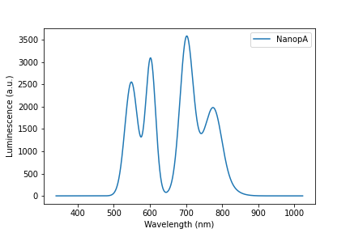
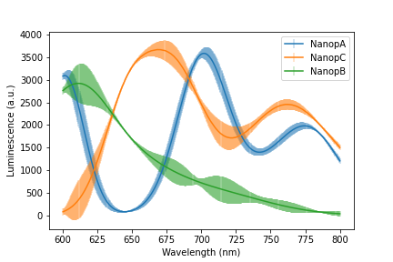
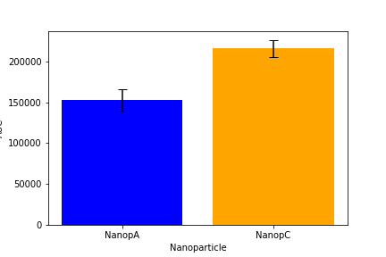

# nanoparticle-characterization
Tools used for researching luminescent nanoparticles

## Requirements
Python >= 3.8

You may instead install miniconda and it will take care of installing python when creating an environment.
https://docs.conda.io/en/latest/miniconda.html

## Installation
It is recommended to first create an isolated python environment.
```
$ conda create -n ki python=3.8
$ conda activate ki
```
Then install the repo as a python package called '`kira`'.
```
$ pip install git+https://github.com/fcossio/nanoparticle-characterization
```

## Usage
This repo has 2 specific use-cases:
### 1. Estimate radius of a nanoparticle
Estimate the radius of a nanoparticle based on the measurement of BET specific surface area analysis, assuming a spherical morphology of the nanoparticle.

It can be used as a python method:
```
>>> from kira.bet.radius import BET_radius
>>> surface, surface_err = 20.5, 0.1  # (m²/g)
>>> density = 6.02  # (g/cm³)
>>> radius, radius_err = BET_radius(surface, surface_err, density)
>>> print(f"Estimated radius = {radius:.2f} ± {radius_err:.2f} nm")

Estimated radius = 24.31 ± 0.12
```

This method has been wrapped in a CLI command for ease of use directly on the terminal:
```
$ bet <surface> <surface_err> <density>
```

### 2. Load and analyze Spectrophotometer measurements in an organized way
The idea is that many different nanoparticles will be measured in the spectophotometer along with a reference. Multiple runs of the same measurement may be performed in order to estimate the error.
Then, the different nanoparticles and runs need to be be compared through plots.
See [example](example/usage_example.md)

Read multiple measurements and average them.



Compare multiple nanoparticles with different reference measurements and standard deviations.



Obtain Area Under the Curve.



